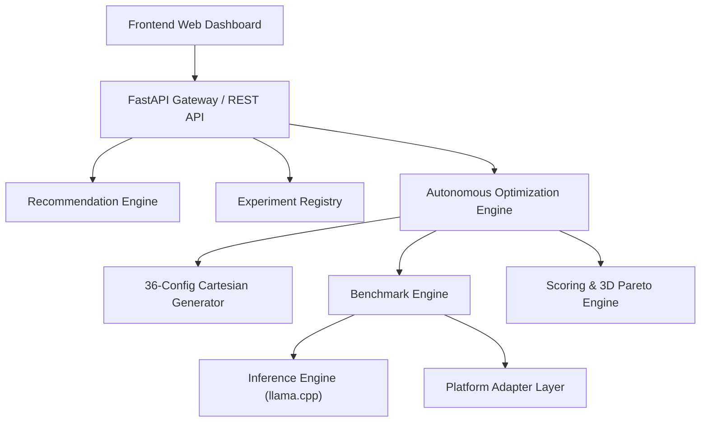

# ARMScale
**Autonomous AI Inference Optimizer & Hardware-Aware Hyperparameter Search Engine**

[](file:///c:/New%20folder/tests/)
[](https://www.python.org/)
[](LICENSE)
[](docs/GOOGLE_AXION.md)

ARMScale is an autonomous, platform-agnostic AI inference optimization engine that discovers optimal deployment configurations for Large Language Models (LLMs) on cloud and edge hardware (such as Google Axion C4A Arm64, AWS Graviton, and AMD64 hosts).

---

## ⚡ Key Capabilities
- **Autonomous Global Multi-Dimensional Search**: Jointly searches the complete 36-configuration Cartesian product:
  $$\text{Search Space} = \text{Quantizations (3)} \times \text{CPU Threads (4)} \times \text{Context Sizes (3)} = \mathbf{36\text{ Configurations}}$$
- **Verified Quantization Variant Catalog**: Cryptographically verified GGUF weights (`Q4_K_M`, `Q5_K_M`, `Q8_0`) from `Qwen/Qwen2.5-0.5B-Instruct-GGUF`.
- **Workload Specialization**: Independent characterization for `short_generation` interactive latency (~15 input tokens) vs. `context_stress` document analysis (~650 input tokens).
- **Objective-Driven Recommendations**: Autonomous decision engine recommending configurations for **Speed**, **Throughput**, **Model Footprint / Size**, and **Balanced** objectives.
- **Empirical 3D Pareto Analysis**: Non-dominated frontier calculations across Latency ($\downarrow$), Throughput ($\uparrow$), and Model Size ($\downarrow$).
- **Live Web Dashboard**: Interactive Latency vs. Throughput trade-off scatter plot with model size scaling and complete 36-configuration ranking matrix.
- **Zero-Fabrication Architecture**: Strict monotonic timing with raw per-run artifact preservation.

---

## 📊 Summary of Measured Results

### A. Short-Generation Interactive Workload (`short_generation`, 36 Configs)
*Experiment ID: `7242f5f7`*
- **Global Winner**: `cfg_Q4_K_M_T6_C4096` (`Q4_K_M`, Threads: 6, Context: 4096)
  - **Mean Latency**: `1801.65 ms` (**`+32.56%` improvement** vs Phase C baseline `2671.42 ms`)
  - **Mean Throughput**: `48.14 tok/s` (**`+47.08%` improvement** vs Phase C baseline `32.73 tok/s`)
  - **Model Footprint**: `468.6 MB`

### B. Context-Stress Long-Context Workload (`context_stress`, 36 Configs)
*Experiment ID: `1e6bc7d2`*
- **Global Speed & Throughput Winner**: `cfg_Q8_0_T8_C2048` (`Q8_0`, Threads: 8, Context: 2048)
  - **Mean Latency**: `4310.92 ms` (**`+20.35%` improvement** vs context baseline `5412.55 ms`)
  - **Mean Throughput**: `25.82 tok/s` (**`+28.72%` improvement** vs context baseline `20.06 tok/s`)
  - **Model Footprint**: `644.4 MB`
- **Global Size Winner**: `cfg_Q4_K_M_T4_C1024` (`468.6 MB`, `4381.38 ms`, `24.32 tok/s`)

---

## 🚀 Quickstart

### 1. Setup Environment
```bash
git clone https://github.com/pratykshparmar00-coder/ARMScale.git
cd ARMScale
python -m venv .venv
# On Windows: .venv\Scripts\Activate.ps1
# On Linux / macOS: source .venv/bin/activate
pip install -r requirements.txt
```

### 2. Download and Verify Model Variants
```bash
# Download all verified GGUF quantization variants (Q4_K_M, Q5_K_M, Q8_0)
python tools/download_model.py --variant all
```

### 3. Run Global Optimization Sweeps (36 Configurations)
```bash
# Run 36-configuration sweep on short generation
python tools/optimize.py --dimension global --workload short_generation --objective speed

# Run 36-configuration sweep on context stress
python tools/optimize.py --dimension global --workload context_stress --objective speed
```

### 4. Launch Local Web Dashboard
```bash
python main.py
# or: uvicorn backend.api.main:app --host 127.0.0.1 --port 8000
```
Open `http://localhost:8000/` in your browser.

---

## ☁️ Deployment Guide

### Deploy on Vercel (Frontend & Serverless API)
1. Import repository on [Vercel](https://vercel.com/dashboard).
2. Framework Preset: **Other** (Root directory: `.`).
3. Vercel automatically uses [`api/index.py`](api/index.py) and [`vercel.json`](vercel.json).
4. Click **Deploy**.

### Deploy on Render (Backend Web Service)
1. Create a **Web Service** on [Render](https://dashboard.render.com/).
2. Select your repository `ARMScale`.
3. Set **Build Command**: `pip install --prefer-binary -r requirements.txt`
4. Set **Start Command**: `python main.py`
5. Click **Create Web Service**.

---

## 🧪 Testing Suite

Run the full automated unit and integration test suite:
```bash
pytest tests/
```
All **44 automated tests** pass covering model downloads, SHA256 integrity, 3D Pareto frontier calculations, all 4 objective scoring modes, candidate generation, and REST APIs.

---

## 🏛️ System Architecture



---

## 📚 Detailed Documentation
- [Phase H Global Optimization Report](docs/GLOBAL_OPTIMIZATION.md)
- [Quantization Optimization Guide](docs/QUANTIZATION_OPTIMIZATION.md)
- [Multi-Dimensional Optimization](docs/MULTI_DIMENSIONAL_OPTIMIZATION.md)
- [System Architecture](docs/ARCHITECTURE.md)
- [Platform Abstraction Layer](docs/PLATFORM_ARCHITECTURE.md)
- [Google Axion C4A Deployment](docs/GOOGLE_AXION.md)
- [Axion Setup Guide](docs/DEPLOYMENT_AXION.md)

---

## ⚖️ License
This project is licensed under the MIT License - see the [LICENSE](LICENSE) file for details.
