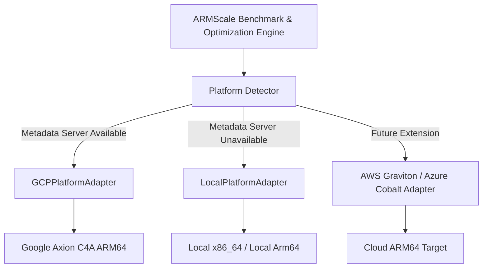

# ARMScale Platform Architecture

## Overview
ARMScale is designed with a cloud-agnostic and architecture-aware platform abstraction layer. The optimization algorithms, benchmark engines, statistical aggregations, and result schemas remain 100% identical regardless of whether ARMScale is running on a local x86_64 workstation, a Google Cloud Axion C4A Arm64 VM, or an on-premise Arm64 server.



---

## Supported Platform Adapters

### 1. `LocalPlatformAdapter`
- **Target**: Workstations, developer laptops, local bare-metal testbeds.
- **Detection**: Uses Python's native `platform`, `sys`, and `psutil` libraries.
- **Provider Label**: `local`
- **Cloud Provider**: `null`

### 2. `GCPPlatformAdapter`
- **Target**: Google Compute Engine virtual machines (including `c4a-standard-*` Google Axion Arm64 instances).
- **Detection**: Dynamically queries the internal GCP Metadata server (`http://metadata.google.internal/computeMetadata/v1/instance/`).
- **Detected Metadata**:
  - `cloud_provider`: `"Google Cloud"`
  - `machine_family`: `"C4A"` (for Axion) or instance family prefix
  - `processor_family`: `"Google Axion"` (when `c4a-*`)
  - `machine_type`: (e.g., `"c4a-standard-4"`)
  - `zone` & `region`: (e.g., `"us-central1-a"`, `"us-central1"`)
  - `instance_id`: Unique GCE instance ID

---

## Standard Platform Schema
Every benchmark and optimization artifact embeds the standardized platform schema:

```json
{
  "platform": {
    "provider": "local",
    "cloud_provider": null,
    "architecture": "amd64",
    "is_arm": false,
    "status_message": "DEVELOPMENT ENVIRONMENT — x86_64",
    "machine_family": null,
    "machine_type": null,
    "processor_family": null,
    "cpu": "AMD64 Family 23 Model 96 Stepping 1, AuthenticAMD",
    "physical_cores": 6,
    "logical_cores": 12,
    "ram_gb": 15.42,
    "zone": null,
    "region": null,
    "os": "Windows",
    "os_release": "11",
    "python_version": "3.12.10"
  }
}
```

---

## Architecture Integrity
ARMScale enforces strict environmental awareness:
- If `is_arm` is `False`, the system explicitly records `DEVELOPMENT ENVIRONMENT — x86_64`.
- x86_64 results are never labeled as Arm64 cloud results.
- When deployed on Arm64 hardware (`aarch64`), the exact same pipeline runs natively and records `ARM64 ENVIRONMENT — BENCHMARK ELIGIBLE`.
